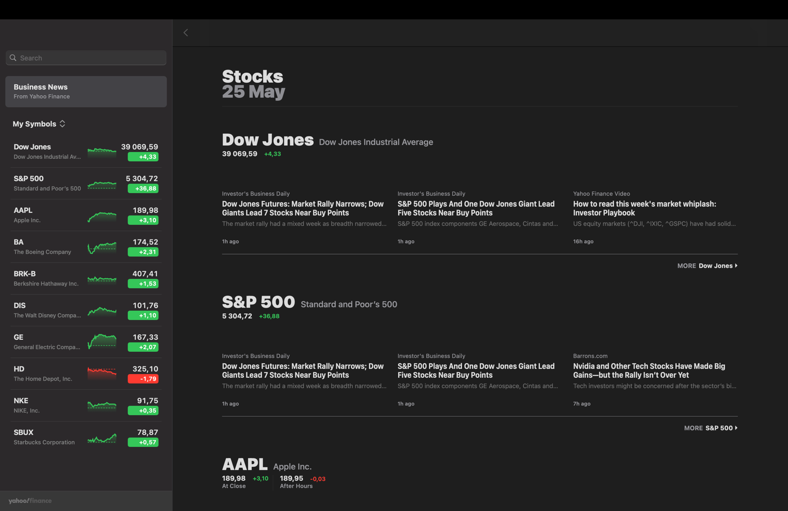
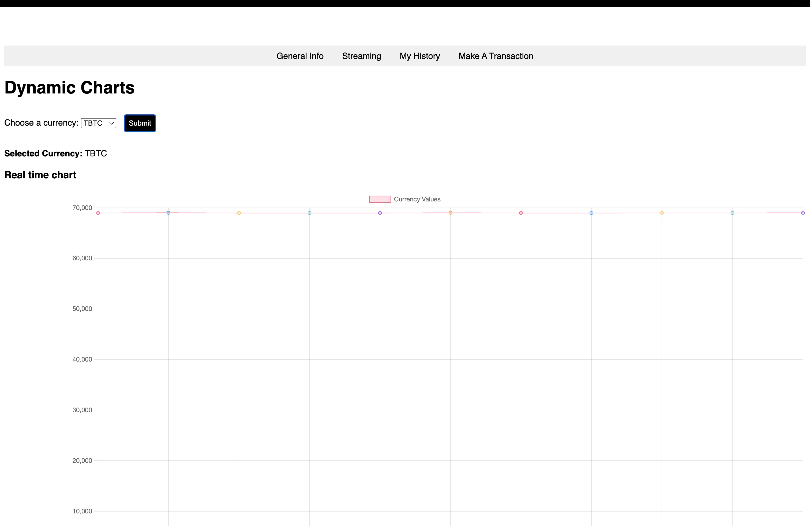
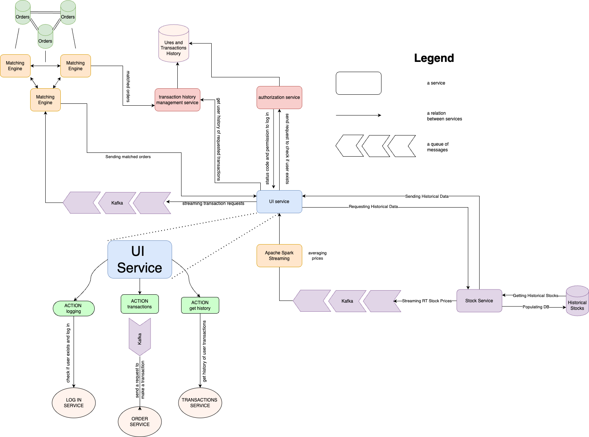
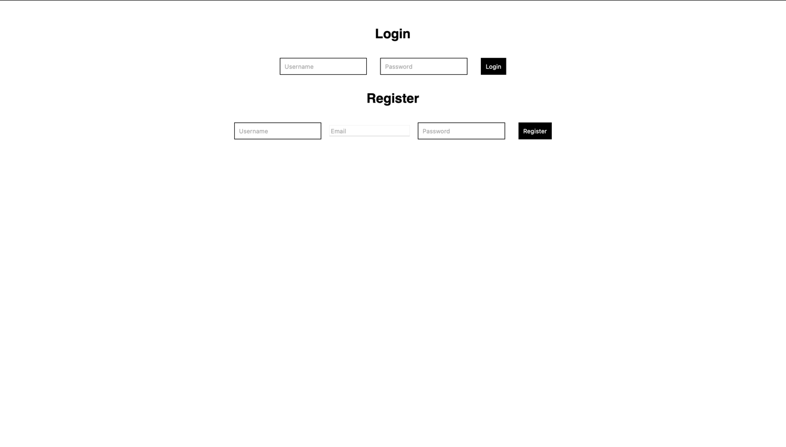
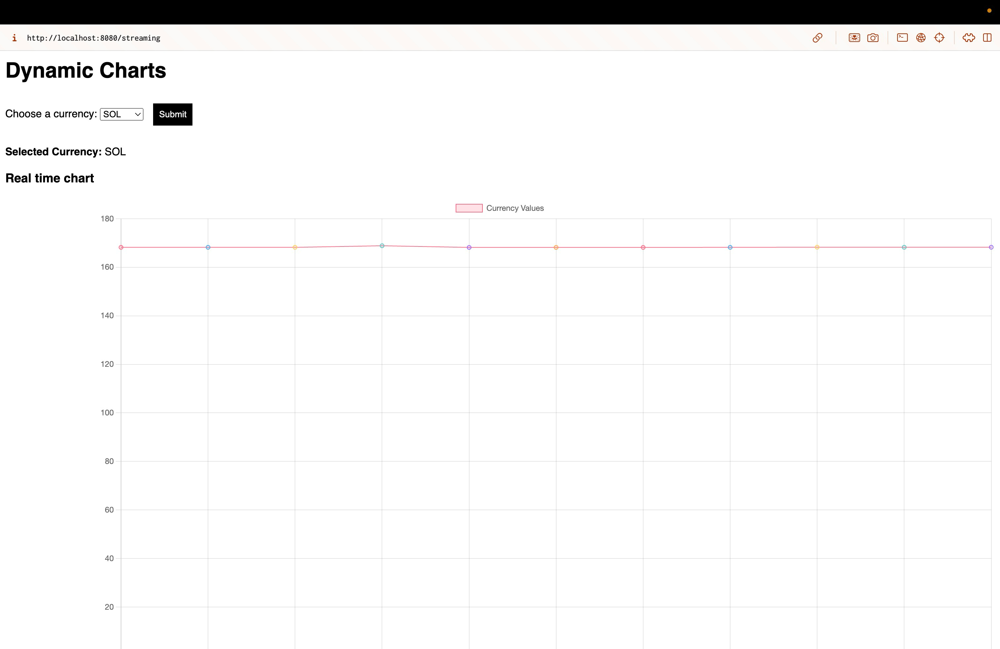
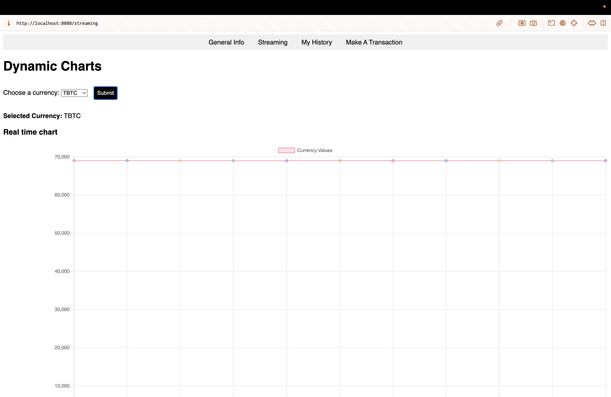
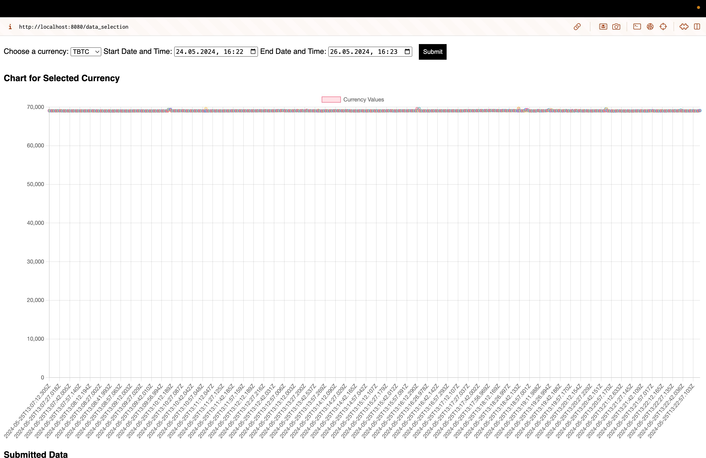
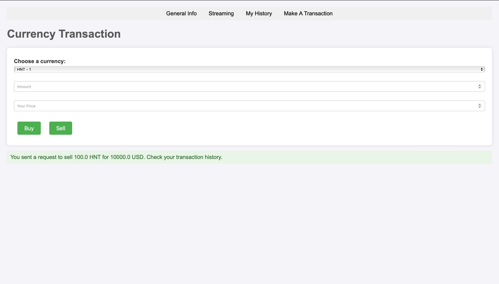
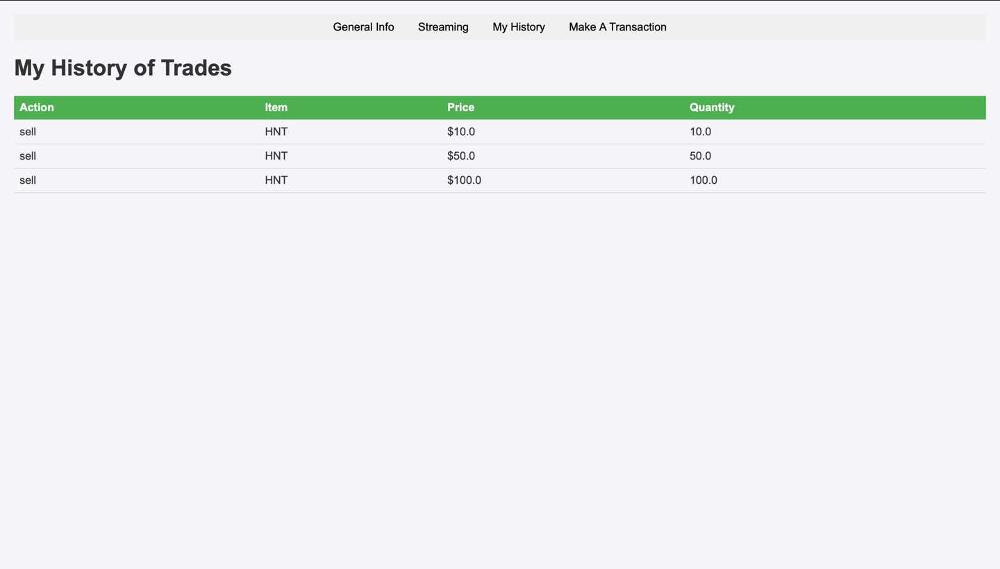
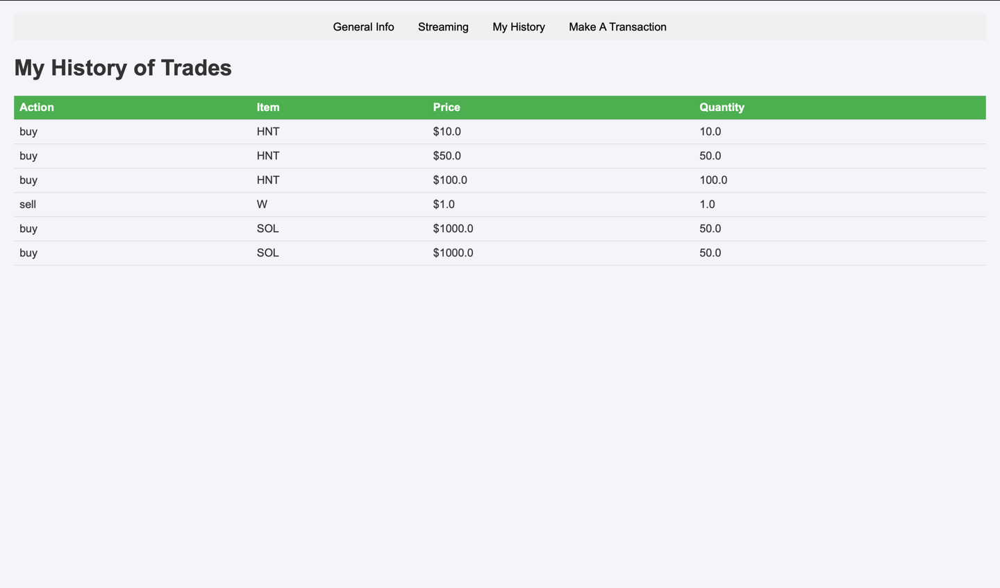

# Stocks Service

## Authors

- **Liubomyr Oleksiuk**: https://github.com/Liubavaa
- **Nazar Demchuk**: https://github.com/uandere
- **Liliana Hotsko** (not a Big Data course member, consent granted)
- **Anna Polova** (not a Big Data course member, consent granted)

## Description

We've worked for a long time to create a financial application that 
provides users with real-time and historical stock market information.
This application can be thought of as aquivalent of Stocks app on Apple
macOS. 

Here's a comparison of interfaces (the first one is a title page of the
Stocks application, the second one is our equivalent):





Here's a full list of features that our service allows for:
- registration and login system
- watching real-time prices of popular cryptocurrencies
- getting historical data for each cryptocurrency
- simulate real-time orders and order-matching mechanism
- viewing user's transactions

## How to use

We used a microservice architecture and dockerized the whole system to be
able to deploy it at one node easily.

So, to start our project, just clone the project from this branch and
use `docker compose`:

```shell
docker compose up -d
```

## How it works

Below, you will find a detailed diagram of the services and 
their interaction.
This includes four main services and a lot of auxiliary ones.
The general diagram, covering all services and their bonds can be found
[here](https://drive.google.com/file/d/1UtWhfWyHZb7g-cYWVBdk9J_FMCKaACQu/view?usp=sharing).


**ATTENTION**: _there was a requirement to use both batch and stream 
processing in the project.
However, due to lack in time, we've only managed to make use of stream 
processing, which handles real-time plots of prices.
The future improvement would involve using batch processing for historical
data view (which could allow, for instance, specifying the number of
data points we'd like to view).

### Diagram



### Main services

#### Stock API Service
The main function of this service is constantly getting prices of
cryptocurrencies from **Jupiter API**, streaming them to **Web UI Service** via
Kafka message queue and populating historical DB with this data for further
exploring.

Streaming is done using Apache Spark, which allows for quick
averaging of prices over small periods of time (the default is a 5-sec 
window).

Written in Rust language for the best performance.

This service has the following modules:
- `routes`: a web layer which powers Axum server and describes routes 
for interaction with it
- `db`: a database layer used to populate historical DB and get data 
from it
- `args/utils/models`: a service + domain layer, which handles data 
specification and transformation.

#### Web UI Service.
This service provides user interface and is responsible for rendering pages,
storing user session and communicating with backend services.

It has a login and registration page which interacts with **User Info Service**,
a page with live charts of some currencies and a page for historical data
from Stock API Service.
It also provides an interface for placing buy or sell
orders to **Matching Engine Service**, and can access transaction history
via **User Info Service**.

#### User Info Service

**User Info Service** provides a business layer for user authentication and 
retrieval of transaction history.
This data is stored is Postgres SQL database.

#### Matching Engine Service.

Three instances of this service are started at startup for reliability.
They receive user orders from **Web UI Service** via Kafka message queue.
Each service instance is connected to its Redis node, where received
orders are saved to.
Then it searches for suit orders, matches them, and sends the created
transaction back to **Web UI Service**.

## Demonstration & Examples

### Registraton/Login


### Real time plots



### Historical data


### Orders


### History of trades



## Summary

We wrote a financial application designed to provide users with real-time
and historical cryptocurrency data, similar to Apple's Stocks app.
Utilizing best design practices, it features a microservice architecture
with Docker, incorporating services for fetching market data, user 
interface, authentication, and order matching.
This setup ensures seamless, efficient, and reliable access to stock
market information and transactions.